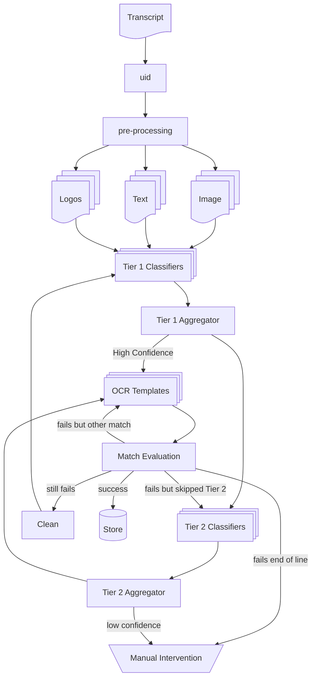

# Transcript Classification

High school transcripts vary greatly, making it difficult to extract necessary data, and scale.

OCR methods that rely on templates, still need to know which template or method to use for extracting data.

Classifiction allows us to send the transcript to the best transcript processor.

Even when transcript come from the same school, they may have been scanned and might not work with the original template in their "raw" state.

## Key Challenges

### Processing Challenges

The pdf transcript examples provided also varied:

- multiple pages, some pages contain transcript data
- Only 31% of the samples had associated text
- Not all transcripts had CEEB Codes
- Not all transcripts list the address of the school or district
- samples can be scanned, skewed or a different size from the original
- samples can be portrait or landscape for same school (NYC), possibly print to pdf settings

### Matching Challenges

- No single way to identify a school, there will need to be a matching process (name, distict, CEEB code, address)
- No single unified format coming in, need to be able to handle, image only, image and text approaches for classification

### Refresh Challenges

Because a school used to match a template, does not guarantee that the transcript hasn't changed and will still work with that template.

### Leveraging Existing Data

Any classification method we come up with will be most valuable if we can leverage our existing data.

Transcript -> School -> Template

In order to use this data for training and testing we will need to extract features, this might be a batch process for periodic updats, until the model becomes an online model.

## Classification Methodology

A tiered mixture of experts.

Reasoning, not all classification models have the same associated cost for running, cpu vs. gpu.

### Tier 1 Classifiers

Inexpensive to run, works serverless, in a shared container, or on minimal cpu instances.

Not all classifiers need to be just image or text classifiers. Some of the best models are ensemble models that are trained in concert.

#### Image Classifiers

Can be more than one approach, not all of which need to be in a single model.

- PHASH
- Palette Matching
- Segmentation
  - OpenCv (depending on operation this could be Tier 2)
  - [DALAI](https://github.com/DALAI-project/Table_segmentation)
  - Ray Casting with high decay
      - Basically take horizontal stripes out of the document, and scan down the stripe, looking for pixel values that remain relatively constant, should accurately pick up table structure if document is not skewed, there would be several stripes (towards top for headers, middle for body, and footer). Stripe data could be a simple column type and count, could be vectorized, possibly histogram, offset of borders.
- Logos, pdftohtml can export embedded images, some of which are school logos, easy quick way to extract embedded images, which should have high conformity

 
#### Text Classifiers

For pdf images that have associated text, or for text only formats, possibly from an API or csv file.

- University this is for, or other metadata
- Spacy, named entity extraction
- Segmentation if pdf text has associated bounding boxes
    - Clustering (HAC)
    - [camelot](https://github.com/atlanhq/camelot)
    - [tabula](https://github.com/tabulapdf/tabula)
- TFIDF/PCA with enough documents, we can get a very accurate document vector, ~10 digits which could be combined with image features for document similarity

### Tier 2

More expensive needs a GPU, dedicated larger instance, LLM, or external API calls (on demand llm).

- OpenCv (some operations take more memory etc.)
- Open Source OCR engines, for segmentation
    - [doctr](https://github.com/mindee/doctr)
    - [tesseract](https://github.com/tesseract-ocr/tesseract)
- LLM calls

## Orchestration

All orchestration is meant to be paired with persistent storage, such as postgres paired with key/value cloud storage for larger payloads and files, and nosql payloads. To mimize connections to postgres db, redis or dynamodb will be used by aggregators. At a minimum the transcript uid, and location of the metadata file, which has names and locations of associated files, are stored in postgres. The metadata itself, while it could be in jsonb temporarily for quick easy analysis is not scaleable, and should likely be put in Aurora, nosql, or simply cloud storage.

Chosing from the platform(s) below will depend on what you already have in place, and how it is currently getting used. If there is nothing in place, then prior to making a reccomendation I would likely need more background of intended future use, ie: real time in app, burst volumes, etc.

### Kafka

Pros: observability, scaleability, industry standard
Cons: expense of cluster, setup and mgmt

### Cloud PubSub/Queues

Pros: low cost, scaleable
Cons: less observable, extending may not be as easy (managing many queues)

### Streaming Flink

If timing is super critical (< 1-2 second response), instead or persisting pre-processed files to cloud storage, could consider Flink, or some other streaming approach, still possibly paired with cloud storage.

### Redis, persisted

Pros: simple, fast, rock solid, sufficient if docs in pipeline at one time < 100k
Cons: less observable, not as scaleable

Since I would recommend using redis for initial aggregation would likely use redis queues for initial POC, unless one of the above is already in place. When aggregators outgrow redis (which I don't think they will unless incredible burst volume, or we go international) would need to implement locking on nosql metadata.

## Classification Pipeline

1. Transcript is received with or without metadata, for example the University that is requesting processing
2. Create internal uid for transcript and add to metadata
3. Pre-processing
   a. pdf's and other multi-page image formats (tiff) are split into pages
   b. text and text metadata (bounding boxes poppler tools) are extracted if available
   c. these file names and payloads are added to the original metadata associated with transcript (if any)
   d. all files are added to cloud storage in a uid sub directory along with the original transcript file and metadata
5. Multiple Tier 1 classifiers all provide possible classes and associated confidence, if features are small they are added to metadata
6. Aggregator, All Tier 1 classifiers complete or time out and metadata is updated, if threshold is met skip to match
7. One or More Tier 2 classifiers provide possible classes and associated confidence
8. Aggregator, All Tier 2 classifiers complete or time out and metadata is updated, if threshold is met go to match, if threshold is not met go to manual intervention queue
9. Match, transcript is sent to template
10. Match Evaluation, if sufficient store, if enough data is not pulled from template or data is not of sufficient quality, append metadata with template tried, and if enough confidence to try another template go try it, else go to Tier 2 if skipped, else go to cleaning, else go to manual intervention
11. Cleaning, handle de-skew, de-speckle, border normalization, these can be more expensive opeartions and might need a GPU, when complete go to Tier 1
12. Store - store transcript data in tables, store metadata confidence and features in training table
13. Manual Intervention - add transcript to queue, once matched prioritize adding these to models, Active Learning
14. Sweep, check for transcripts stuck at aggregators, and add to manual handling if needed

    
### Improve Aggregators Over Time

Classifier meta-analysis, track how well classifiers work based on Match Evaluation

Change weighting and thresholds of classifiers based on performance, track for each template.

Update weighting and thresholds in db so, wieghts and thresholds can be "on-line" even before models are.

## Build Initial Dataset

Classify current matches to create a labeled dataset.

Transcript -> School -> Template

With the current database it should not be necessary to have to hand label transcripts.

If the data is not currently in a format where we know which model processed which transcrip then create a table to store this information and gather going forward. 

And yes both clustering and document similarity are certainly possible with an unlabeled dataset.

### Evolving Dataset

By storing features, confidence, and results from the match evaluation our dataset should be able to evolve.

**Goal**: bring some classifiers on line.

**Goal**: with the right features, we could eventually have a vector db such as ES or FastASPI for determining **document similarity**.

### Manual Intervetion and Levels of Automation

In theory, it would be possible to eventuall remove a human in the loop from the "Manual Intervention" step. But this has the potential of being expensive. 

By training on the templates themselves, and matching them with the images, it should be possible to dynamically create templates. Basically the shortcoming of turnkey OCR engines is that they are not particular to our dataset, course numbers, credits, grades etc. We know data types, and with logic here we can either improve returned results, or possibly do manual segmentation for these engines, or move some "templates" in house to our own OCR engine. 

It is highly likely that many documents could be processed in house, so we could set up parallel pipelines and compare results, and then deprecate external engines when our in house solution proves better.

Also LLM's are extremely good at reading, so it is distinctly possible, given enough resources, that we could fine tune an LLM on pdf's that have associated text using the BERT missing words approach using our current dataset. PDFs to images, we know target words from underlying text, we give LLM the images and know the desired words. Some text for pdfs is created by ocr, so it will be critical to only use pdfs that have the original text and bounding boxes, this can likely be found in the pdf source metadata, creation software.

